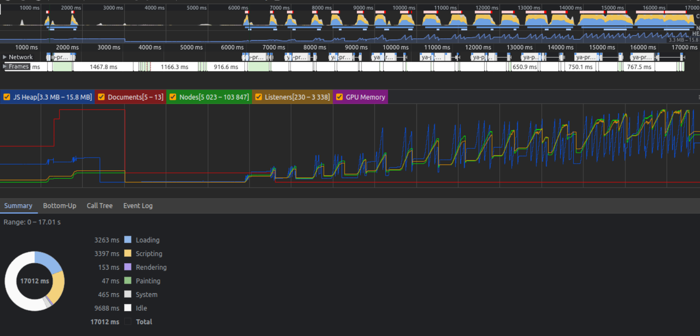
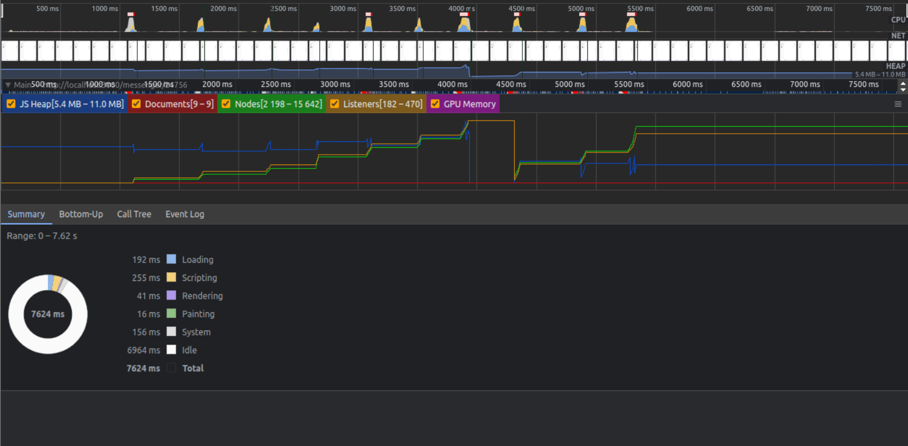

### Оптимизация приложения 

#### План работы:
1. Замерить производительность проекта до рефакторинга
2. Замерить после 
3. Выявить слабые места и исправить их

### Что было до

### Что стало после

При замерах я старался отобразить путь обычного пользователя, переход по чатам написание сообщений.
В глаза сразу бросается уменьшение времени потраченного на замеры. \
В случае до было потрачено 17 секунд, в случае после всего 7.62 секунды. \
Другими словами время уменьшилось почти в два с половиной раза. \
Также уменьшился показатель JS Heap на 5 мб, и количество документов на 4. \
Количество нодов уменьшилось в 6.6 раз, количество слушателей в 7.1 раз, а количество
запросов в 5.3 раза. \
Такие показатели свидетельствует о существенном улучшении производительности, в некоторых случаях
даже больше чем в 5 раз. \
#### Но почему же так было? 

### Слабые места:
1. Утечка памяти связанная с не удалением eventListeners
2. Утечка памяти связанная со Store
3. Утечка памяти связанная с роутером и лишними рендерами компонентов
4. Лишние запросы по API

### Как было исправлено
По большому счету большинство слабых мест были связаны с тем, что у компонентов не было метода
жизненного цикла componentWillUnmount. \
В случае с eventListeners, компоненты рендерились --> на них вешались eventListeners --> но при удалении
компонента эти слушатели не были удалены. \
В случае со Store, была похожая ситуация, Store являлся унаследованным от EventBus, на каждую переменную
в нем вешались колбэки, которые реагировали на обновление хранилища. \
Поэтому в Block (компонент от которого наследуются остальные компоненты) был добавлен метод жизненного
цикла componentWillUnmount. Этот метод срабатывает при размонтировании компонента, и удаляет старые
eventListeners и отписывает колбэки в хранилище. \
В случае с роутером, теперь компонент, не будет рендерится лишний раз, если он
такой же, а будет переиспользован. \
В случае с запросами, пришлось переписать основную логику работы компонентов, 
теперь компонент не будет делать запрос, если в Store уже есть нужные ему данные.

